# README

Gratér is an application that allows users to buy and sell DJ equipment.
The users also have a profile where they can get into contact with other users.

Currently it is in v-1 and the key functions are stated below

- Users can sell DJ equipment on the website, where the item has a price,
 description, name, part of a category and an image of the equipment.
- The website also allows users who do not sign up to view the items on the
platform. However, to buy items or to  view profiles, the user must login or
create an account. The login system used in the application is Devise.
- Users can also buy the DJ equipment where the payments are made via stripe.
- After the user pays for an item, they get an email via MailGun with a receipt
of their purchase.
- Users can also go to the profile of a seller and see the items that are only
sold by that user.
- Users can message each other via the applications internal messaging system.
- Users can also leave a review on the profile page of another user. This system
is built for reviewing a seller.

Several steps have been put in place for Version 2 of Graté. Currently, for v-1
the user can receive DJ party offers from other users. However, for v-1 the user
cannot accept these bookings. Version 2 will have a simple booking system where
users can book other users to DJ at the event they may have.

Version 2 will have the following features
- Users will be able to upload a Video of their DJ sets/concerts they played at.
- Users will be able to accept bookings from offers they receive from other
users.
- Users will be able to say where they have previously played before.
- Will look at integration with Anyone-Anywhere app which links big name DJs with
event organizers.

# Deliverables

## The Problem

Buying DJ equipment is expensive and hard to get. There is no platform for DJ’s to sell or rent equipment that they are not using.

There is also no platform for DJ’s to have a profile where people can see what music they play, if they do parties, and how much they charge.

Gratér will be a platform where DJ's can sell equipment, upload songs, get into contact with other DJ's and get hired by future employees using the platform.

## The Target

### Sellers
DJ’s with equipment they are not using and want to sell.

DJ’s with equipment that they want to rent.

DJ’s who are just starting out and cannot afford to have a website or to sign to a label.

## Buyers
People who want to rent DJ equipment.

People who want to find a DJ for their parties.

# The Pains

## Sellers
Have to list the item on eBay or GumTree not a community for DJ’s to sell items.

Renting DJ equipment is from DJ Warehouse, who control the prices. A DJ can’t rent any equipment they may have.

No platform for DJ’s to rent their equipment they are not using.

# Buyers
No simple website with just second hand DJ equipment, hard to find the items that I want to buy.

Renting equipment is expensive and has to be done from DJ Warehouse.

Also, no DJ’s to contact who have actual experience. I want to learn how the equipment may work.

There is no place to contact DJ’s about if they are available for a party or for general advice.

# Why this?
DJ equipment is expensive and it is also expensive to rent.
### Why?
Finding 2nd hand equipment is hard and renting websites have a monopoly where they can charge what they want.
### So why this?
Here comes Grater, a DJ marketplace where users can buy & sell DJ equipment for a fair price and interact with other users.

# Why now?
DJ’s are becoming more and more popular.
### Why?
Electronic music is at the forefront with hip hop.
### Why?
Technology and equipment has gotten better.
### So why now?
To further your skills and develop your craft, you need access to equipment that might be too expensive to buy brand new.

# User Stories
User stories can be found on my Trello Board. I have also attached a screenshot
of the first view of Trello board.

[Link to User Stories Trello Board](https://trello.com/b/Wu8U4WmC)

Screenshot of Trelloboard

# Wire Frames

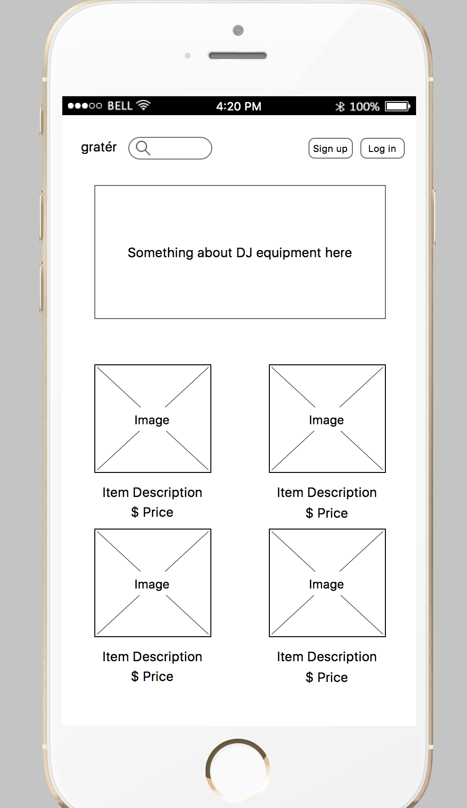
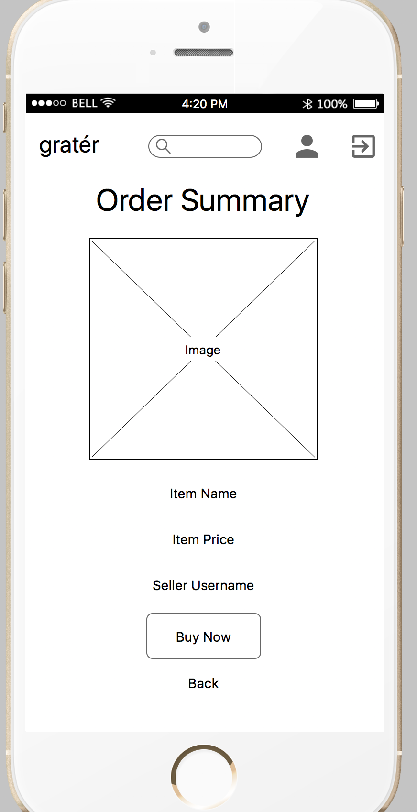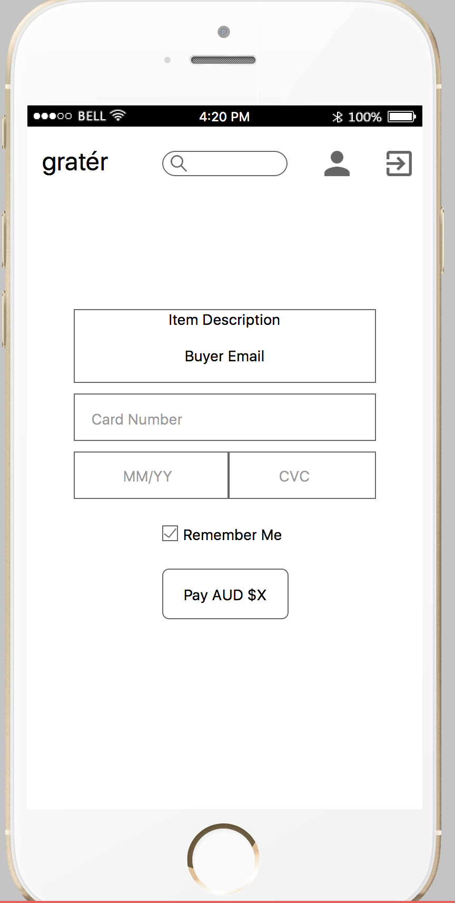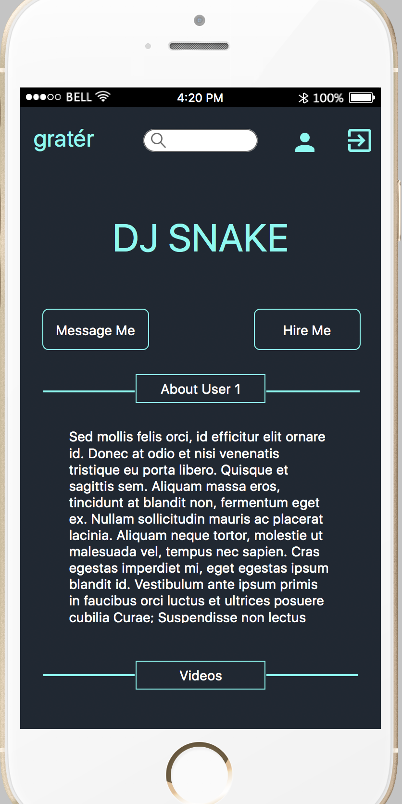
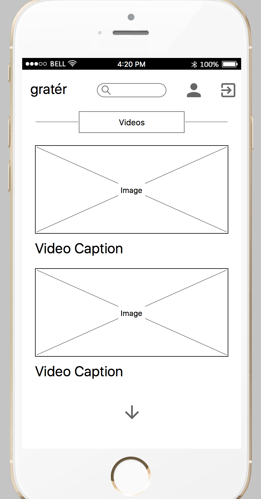)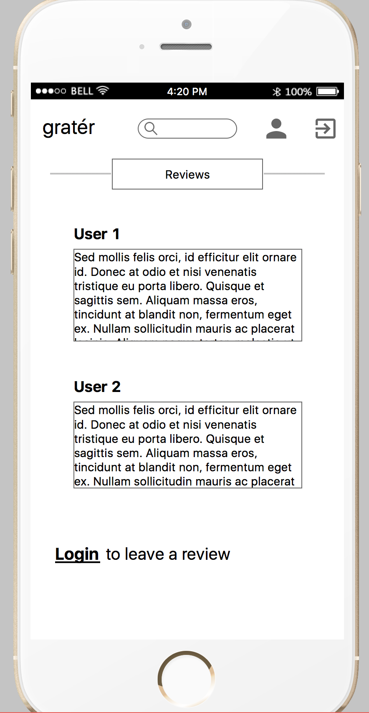

# High Fidelity Wireframes via Sketch
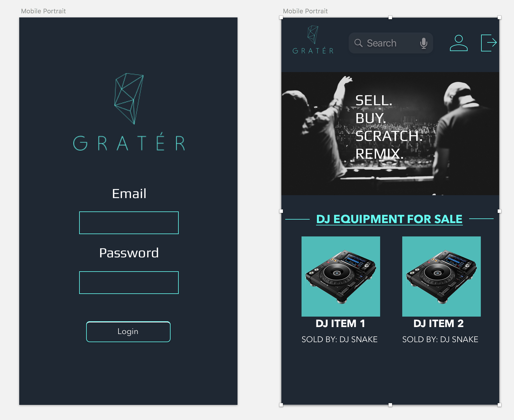
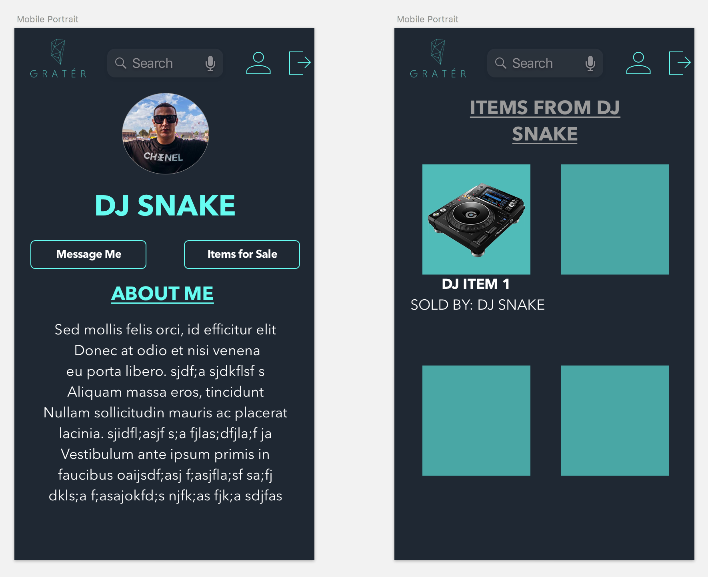
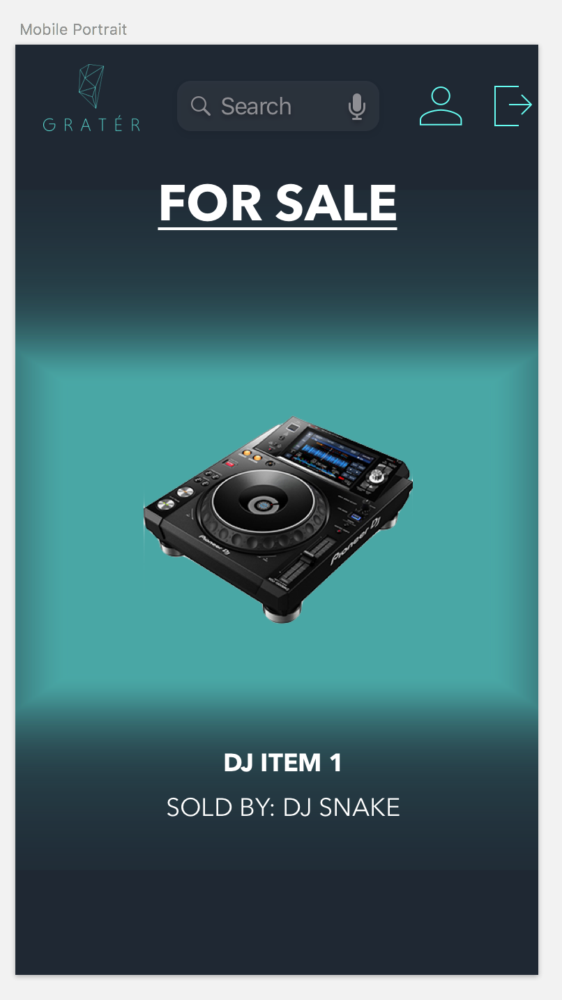

# Workflow diagram of user Journey
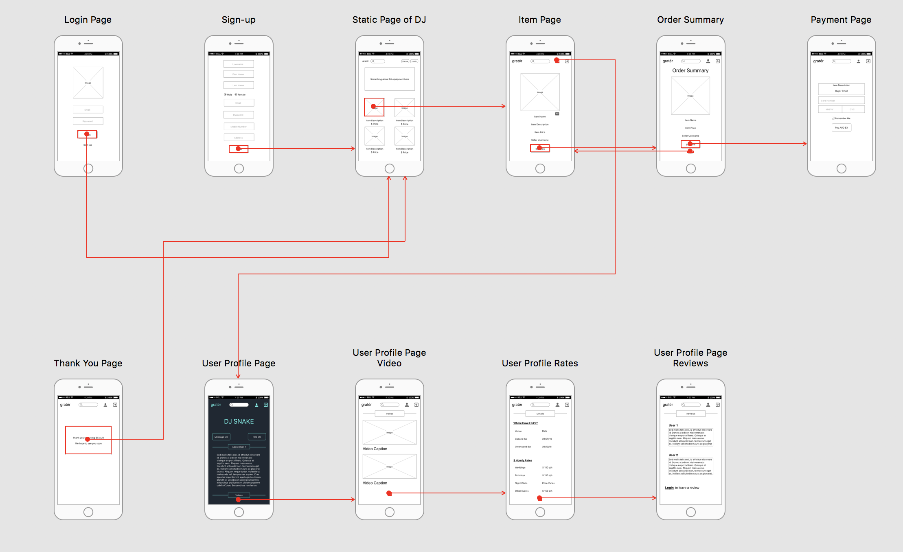

# ERD
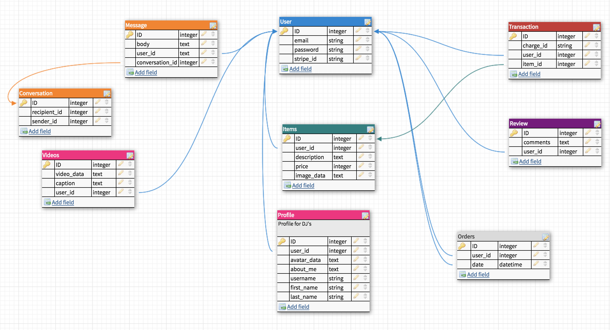

# Rails application code
### Demonstrate Ruby on Rails development skills.

- [x] Create your application using Ruby on Rails.
- [x]  Demonstrate knowledge of Rails conventions.
- [x]  Use postgresql database in development.
- [x] Use an API (eg. Omniauth, Geocoding, Maps, other..).
- [ ] Use appropriate gems.
- [x] Use environmental variables to protect API keys etc. (dotenv)
- [x] Implement a payment system for your product. (e.g. Stripe)
- [x] Your app must send transactional emails (eg. using Mailgun).
- [x] Your app should have an internal user messaging system.
- [x] Your app will have some type of searching, sorting and/or filtering capability.
- [x] Your app will have some type of file uploading capability (eg. images).
- [x] Your app will have authentication (eg. Devise, must have full functionality in place).
- [x] Your app will have authorisation (users have restrictions on what they can see and edit).
- [ ] Your app will have an admin dashboard for the admin user to administrate the site.
- [x] Document your application with a README that explains how to setup, configure and use your application.

## License

This project is licensed under the MIT License - see the [LICENSE.md](LICENSE.md) file for details

## Acknowledgments
Thank you to the whole CodeAcademy Team!
